# 🎵 Spotify Clone (Django)

A full-featured clone of the popular Spotify platform built with Django. This web application allows users to register and log in, browse trending music and artists, and view detailed information about specific songs and artists. Data is pulled in real-time from an external music API (via RapidAPI), giving the site a modern and dynamic feel.

Whether you're looking to explore top global tracks or dive into the discography of your favorite artist, this project offers an interactive and intuitive experience built entirely with Python and Django.

## 🔧 Features

* **User Authentication**
  Register and log in securely using Django's built-in authentication system.

* **Real-time Music Data**
  View weekly top artists and tracks fetched directly from a live external API.

* **Artist Profiles**
  Browse artist pages that include profile images, names, and a list of top tracks.

* **Track Information**
  Each song page includes a title, artist name, album cover, and track duration.

* **Clean & Responsive UI**
  Styled with Bootstrap for a clean, mobile-friendly user interface.

* **Error Handling**
  Graceful fallbacks if API data is missing or unavailable.

## 🌐 API Endpoints

| Path                 | View Function     | Description                                                  |
| -------------------- | ----------------- | ------------------------------------------------------------ |
| `/`                  | `index`           | Renders the homepage.                                        |
| `/signup/`           | `signup`          | User registration page, with a form to create a new user.    |
| `/login/`            | `login`           | User login page, with a form to authenticate existing users. |
| `/logout/`           | `logout`          | Logs out the user and redirects to the login page.           |
| `/user_in/`          | `user_in`         | Dashboard for logged-in users.                               |
| `/library/`          | `library_user`    | Displays a list of top artists fetched from the Spotify API. |
| `/songs/`            | `top_tracks_view` | Displays a list of top songs fetched from the Spotify API.   |
| `/music/<str:pk>/`   | `music`           | Displays metadata and audio for a specific song.             |
| `/profile/<str:pk>/` | `profile`         | Displays profile information for a specific artist.          |


## 📸 Screenshots

| Screenshots                     | 
| ----------------------------- | 
| 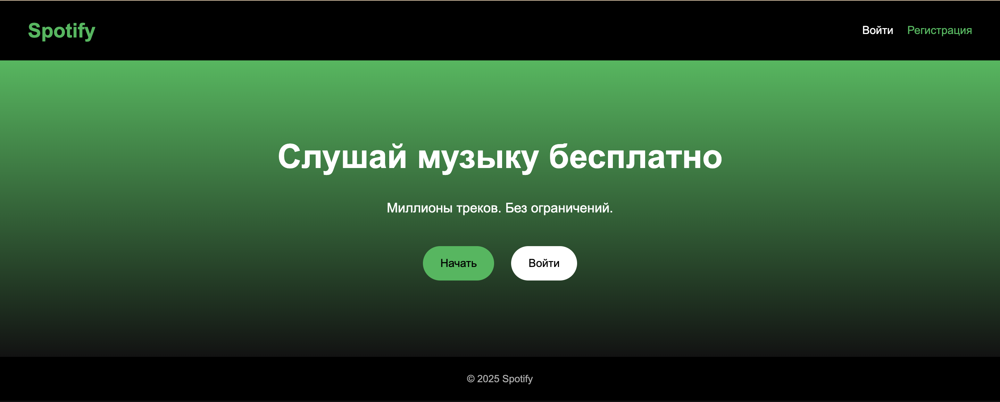 | 
|  | 
| 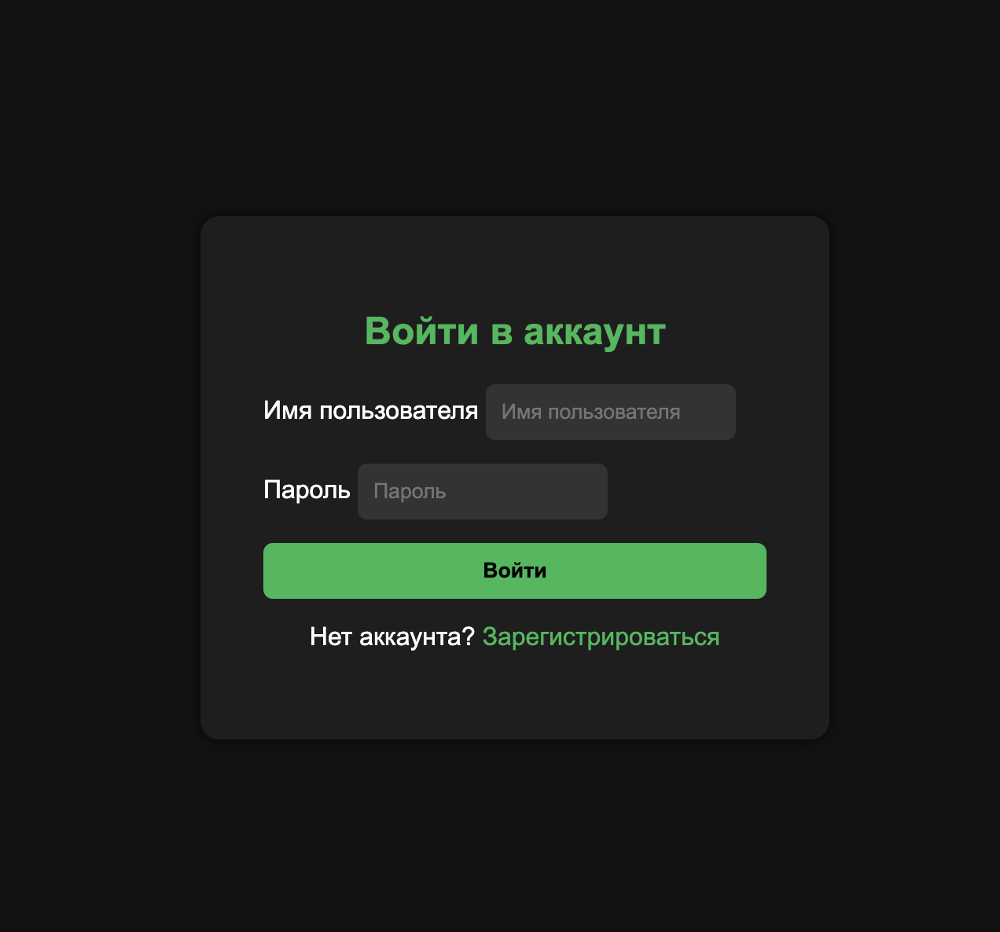 | 
|  | 
| 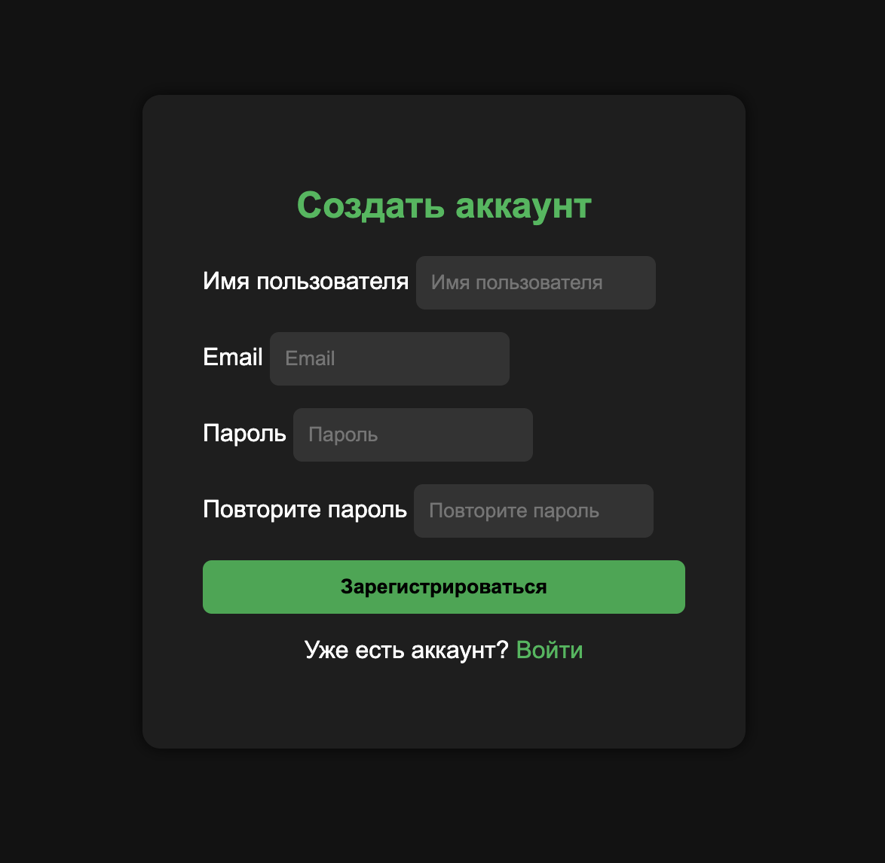 | 
|  | 
| 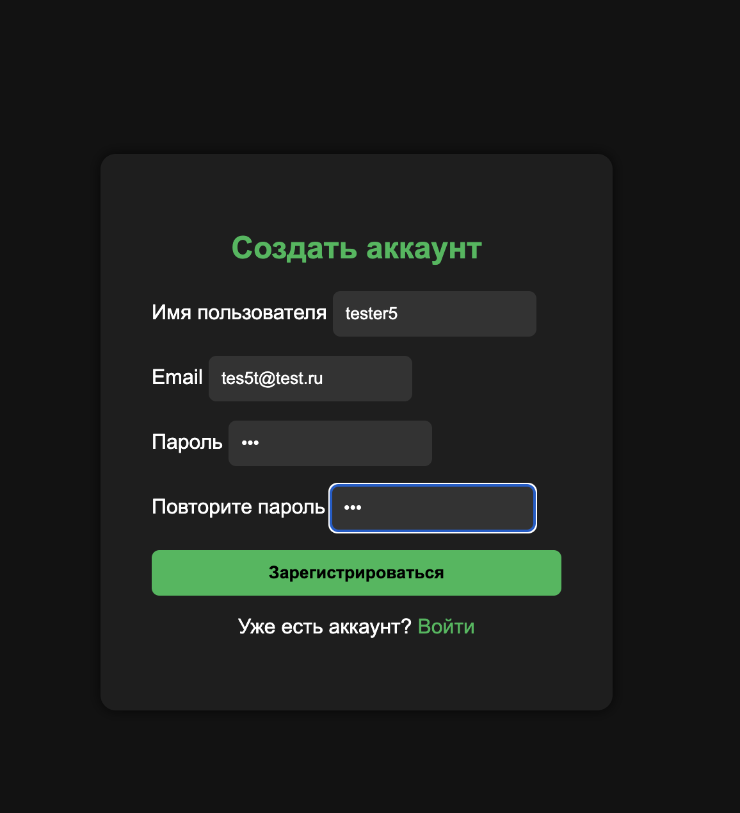 | 
|  | 
| 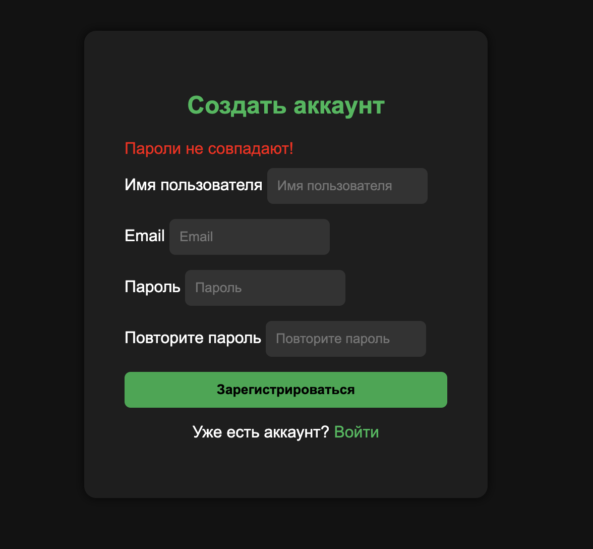 | 
|  | 
| 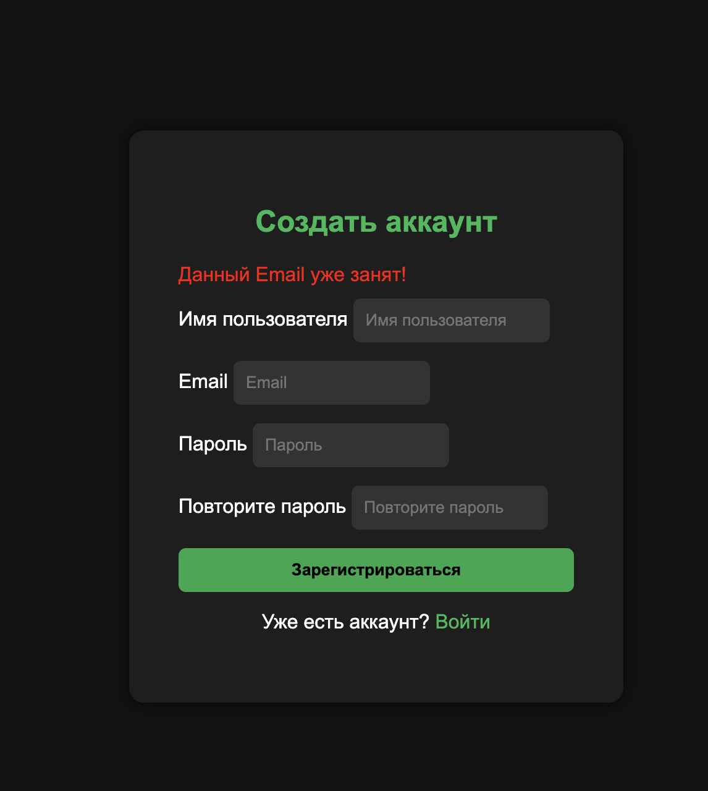 | 
|  | 
| 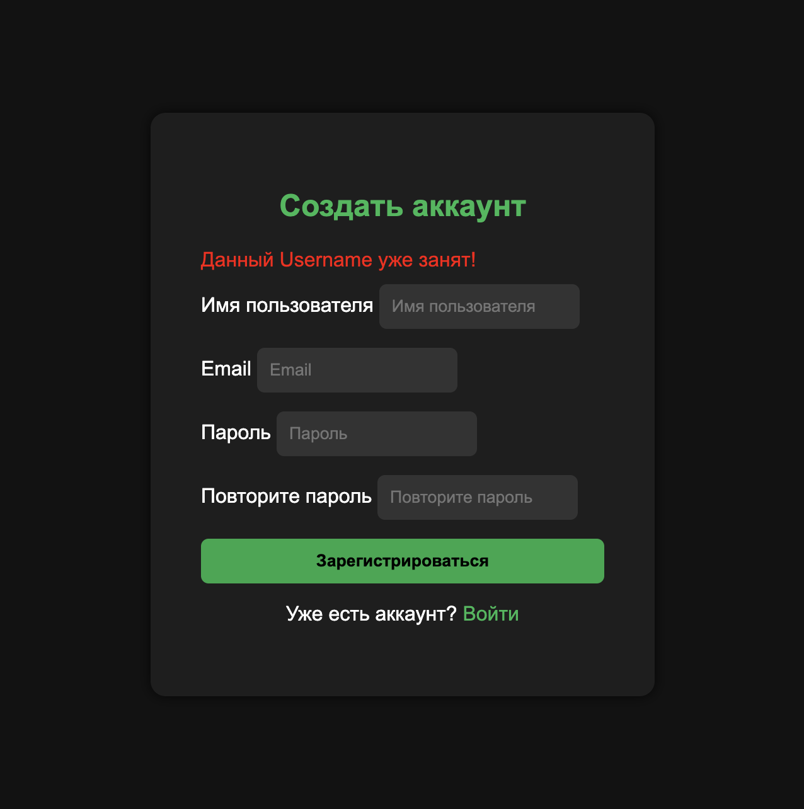 | 
|  | 
| 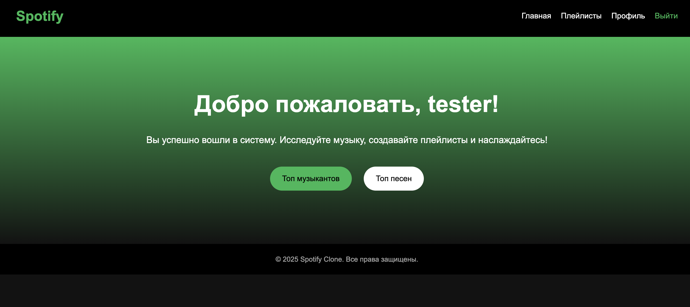 | 
|  | 
| 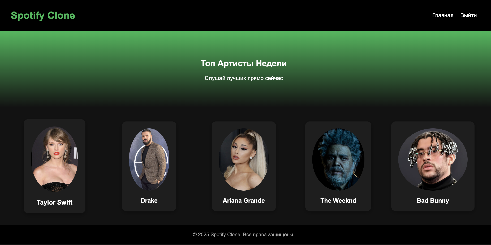 | 
|  | 
| 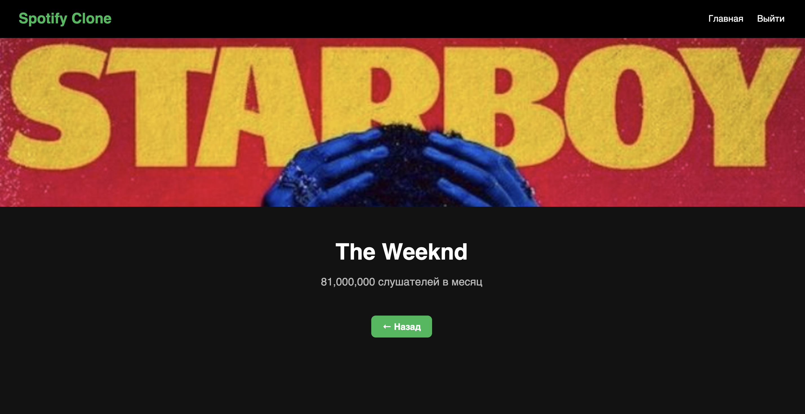 | 
|  | 
|  | 
|  | 
| 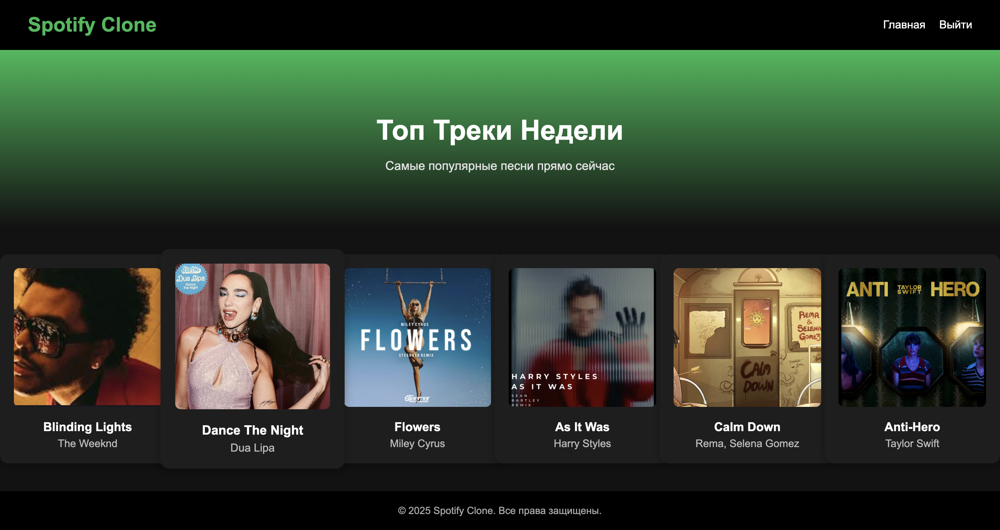 | 
|  | 
| 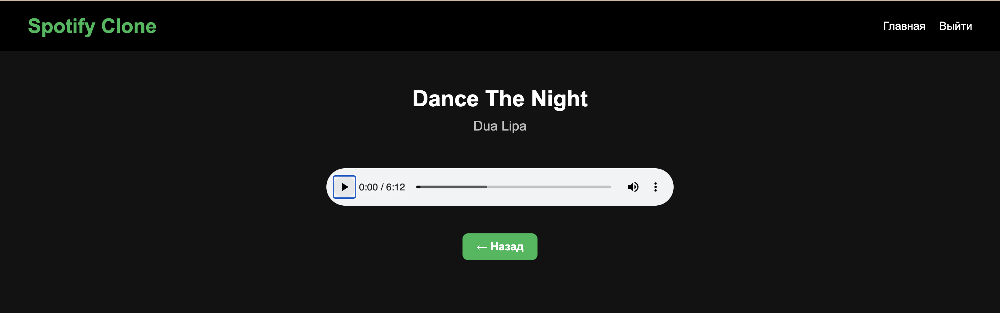 | 
|  |


## 🚀 Installation

1. **Clone the repository:**

```bash
git clone https://github.com/Adil-Bikiev/Spotify-Clone.git
cd spotify-clone-django
```

2. **Create and activate a virtual environment:**

```bash
python -m venv venv
source venv/bin/activate  # On Windows: venv\Scripts\activate
```

3. **Install dependencies:**

```bash
pip install -r requirements.txt
```

4. **Create a `.env` file with your RapidAPI key:**

```
RAPIDAPI_KEY=your_rapidapi_key_here
```

5. **Run migrations and create a superuser:**

```bash
python manage.py migrate
python manage.py createsuperuser
```

6. **Start the development server:**

```bash
python manage.py runserver
```

7. **Open in your browser:**

```
http://127.0.0.1:8000/
```
## 🛠️ Technologies Used

* Python 3.11+
* Django 4.x
* RapidAPI (Spotify data)
* SQLite (default database)

## 📜 License
This project is licensed under the **MIT License**.
